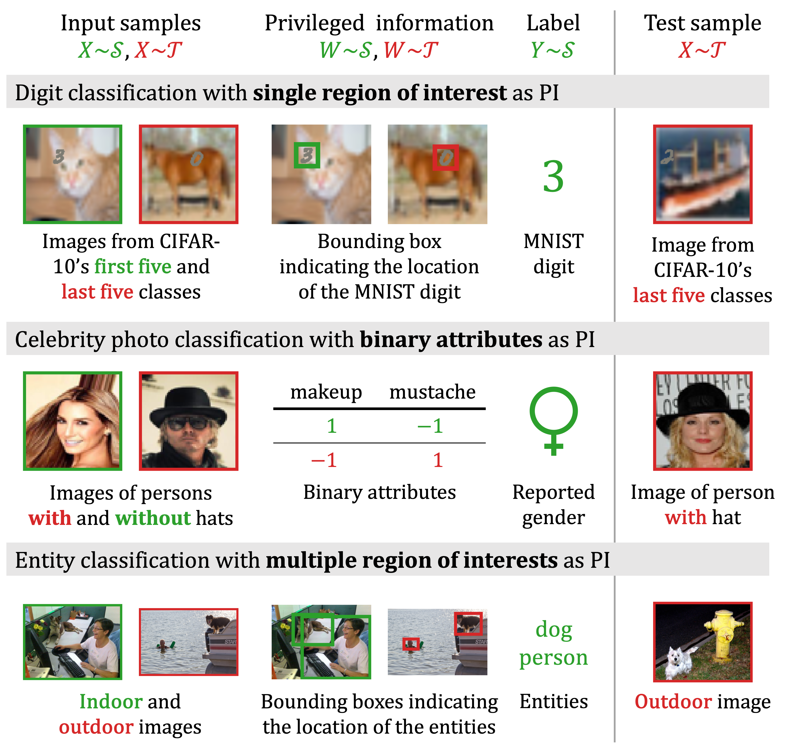

# Unsupervised domain adaptation by learning using privileged information

Unsupervised domain adaptation is guaranteed to be successful only under strong assumptions such as covariate shift and overlap between source and target domains. The assumption of overlap is often violated in high-dimensional applications such as image classification. In this work, we show that access to side information about examples from the input domains can help relax said assumptions and increase sample efficiency in learning. We call this setting domain adaptation by learning using privileged information (DALUPI). The figure below illustrates several applications with the DALUPI structure.

This repository contains the code used to run the experiments in [our paper](https://openreview.net/forum?id=saV3MPH0kw), published in _Transactions on Machine Learning Research_ in September 2024. We refer to the celebrity photo classification task as the CELEB experiment. The digit classification task is referred to as the MNIST experiment. The entity and chest X-ray classification tasks are referred to as the COCO experiment and the chest X-ray experiment, respectively.

If you have any questions, please contact [Anton Matsson](https://www.chalmers.se/personer/antmats/) or [Adam Breitholtz](https://www.chalmers.se/personer/adambre/).



## Installation

Get started by cloning the repository and installing the required packages in a new conda environment. We provide lock files for Linux and OS X, but if needed, you can also create a conda environment directly from [`environment.yml`](environment.yml) using `conda env create`.

```bash
$ git clone https://github.com/antmats/dalupi.git
$ cd dalupi
$ conda create -n dalupi_env -f <lock file>
$ conda activate dalupi_env
$ poetry install
```

## Configuration files

For each experiment, there is a config file in [`configs`](configs) which contains, e.g., data-related paths and default hyperparameters for each model. In [`search_configs`](search_configs), there are search config files which specify the parameters to be swept over (e.g., skewness in the MNIST experiment) and the parameter grids for sampling hyperparameters. In order to reproduce the experiments, you should only modify the configs to update the data paths, as described below, and the path to the results folder. Note that DALUPI, when based on Faster R-CNN, cannot be trained fully deterministically, so the results may vary slightly between runs.

## Data

To prepare the datasets used in the experiments, run [`scripts/make_data.py`](scripts/make_data.py) with each of the config files as input. This step is also performed when [running an experiment](section-4). Before the datasets can be made, the raw data used in each experiment must be downloaded as described below.

### CELEB

Data for the CELEB experiment can be downloaded from [here](https://worksheets.codalab.org/bundles/0xc41b9d26548541e7ad2d2cfbc2c11c73).

### MNIST

Data for the MNIST experiment (MNIST and CIFAR-10 images) will be downloaded automatically the first time this experiment is run. The data will be saved to the directory specified in [`configs/mnist.yml`](configs/mnist.yml).

### COCO

Data for the COCO experiment can be downloaded from [here](https://cocodataset.org/). We used the 2017 version of the dataset but it is possible to specify another version in [`scripts/make_data.py`](scripts/make_data.py). Make sure that the data folder (here named Microsoft-COCO and containing the 2017 version) has the following structure:
```bash
Microsoft-COCO
|-- annotations
|-- test2017
|-- train2017
|-- val2017
```
The path to the data folder should be specified in [`configs/coco.yml`](configs/coco.yml).

### Chest X-ray

Source domain data for the chest X-ray experiment can be downloaded from [here](https://nihcc.app.box.com/v/ChestXray-NIHCC). Target domain data can be downloaded from [here](https://www.kaggle.com/datasets/ashery/chexpert). Specify the path to the respective data folder in [`configs/chestxray.yml`](configs/chestxray.yml) and do not change the original name of the files in these folders. The target segmentations can be downloaded from [here](https://stanfordaimi.azurewebsites.net/datasets/23c56a0d-15de-405b-87c8-99c30138950c). Place the file `gt_annotations_val.json` in the same folder as the target domain data (the other files are not needed).

## Run experiments on cluster

The experiments can be run with SLURM using [`scripts/run_experiment.py`](scripts/run_experiment.py) as described below. Running an experiment creates an experiment folder in the specified results folder and starts a preprocessing job, a set of main jobs, and a postprocessing job. In the preprocessing job, the dataset required for the experiment is created. In the main jobs, models are trained and evaluated. In the postprocessing job, the best models are identified, and the results are compiled into a file `scores.csv`, which is saved to the experiment folder. There is a SLURM template script for each of these steps in [`scripts/slurm_templates`](scripts/slurm_templates). Depending on your cluster, you may need to change or remove some of the initial SLURM commands in these scripts.

### CELEB

```bash
$ python scripts/run_experiment.py \
> --settings source target dalupi adapt_dann adapt_mdd \
> --config_path configs/celeb.yml \
> --search_config_path search_configs/celeb.yml \
> --sweep \
> --account <SLURM account>
```

### MNIST

```bash
$ python scripts/run_experiment.py \
> --settings source target dalupi adapt_dann adapt_mdd \
> --config_path configs/mnist.yml \
> --search_config_path search_configs/mnist.yml \
> --sweep \
> --account <SLURM account>
```

### COCO

```bash
$ python scripts/run_experiment.py \
> --settings source target dalupi lupi adapt_dann adapt_mdd \
> --config_path configs/coco.yml \
> --search_config_path search_configs/coco.yml \
> --sweep \
> --account <SLURM account>
```

### Chest X-ray

```bash
$ python scripts/run_experiment.py \
> --settings source target dalupi adapt_dann adapt_mdd \
> --config_path configs/chestxray.yml \
> --search_config_path search_configs/chestxray.yml \
> --sweep \
> --account <SLURM account>
```

## Run experiments locally
To train and evaluate a single model, use [`scripts/train_predict.py`](scripts/train_predict.py). Running a full experiment is computationally heavy and in practice requires access to multiple GPUs. If you still want to run an experiment on your local machine, run [`scripts/run_experiment.py`](scripts/run_experiment.py) as above but include also the flag `--dry_run`. In this way, an experiment folder containing, e.g., config files for all models that should be trained is created in the specified results folder. Now, run the script below to train all the models in sequence (make sure to specify the path to the newly created experiment folder).

```bash
#!/bin/bash

exp_folder="/path/to/exp"

settings=("source" "target" "dalupi" "lupi" "adapt_dann" "adapt_mdd")  # remove any settings that are not relevant 

for setting in "${settings[@]}"; do
  configs_path="${exp_folder}/${setting}_configs"
  
  if [ -d "$configs_path" ]; then
    configs=("${configs_path}"/config*.yaml)
    
    for config in "${configs[@]}"; do
      command="scripts/train_predict.py"
      command+=" --config_path $config"
      command+=" --setting $setting"
      python $command
    done
  
  fi

done
```

## Alvis usage

The experiments in our paper were run on the [Alvis cluster](https://www.c3se.chalmers.se/about/Alvis/). For Alvis users, assuming the project is located in the folder `dalupi`, a working Python environment utilizing pre-installed modules can be created in the following way:
```bash
$ cd dalupi
$ module load TensorFlow/2.11.0-foss-2022a-CUDA-11.7.0 \
> PyTorch-bundle/1.12.1-foss-2022a-CUDA-11.7.0 \
> Seaborn/0.12.1-foss-2022a \
> scikit-learn/1.1.2-foss-2022a \
> IPython/8.5.0-GCCcore-11.3.0
$ virtualenv --system-site-packages dalupi_env
$ source dalupi_env/bin/activate
$ pip install --no-cache-dir --no-build-isolation \
> gitpython==3.1.31 adapt==0.4.2 skorch==0.11.0 amhelpers==0.4.3 \
> conda-lock==2.0.0 pycocotools==2.0.6 scikit-image==0.19.3
$ pip install --no-cache-dir --no-build-isolation --no-deps -e .
```

The environment can now be activated as follows (must be done at each login):
```bash
$ cd dalupi
$ module load TensorFlow/2.11.0-foss-2022a-CUDA-11.7.0 \
> PyTorch-bundle/1.12.1-foss-2022a-CUDA-11.7.0 \
> Seaborn/0.12.1-foss-2022a \
> scikit-learn/1.1.2-foss-2022a \
> IPython/8.5.0-GCCcore-11.3.0
$ source dalupi_env/bin/activate
```

To launch a Jupyter notebook, run the following commands and select the kernel named "My Python":
```bash
$ python -m ipykernel install --user --name=my_python --display-name="My Python"
$ srun -A <ACCOUNT> -N 1 --gpus-per-node=<GPU>:1 -t 180 --pty jupyter notebook
```

## Citation

If you use this work, please cite it as follows:
```bib
@article{breitholtz2023dalupi,
  title={Unsupervised domain adaptation by learning using privileged information},
  author={Breitholtz, Adam and Matsson, Anton and Johansson, Fredrik D},
  journal={arXiv preprint arXiv:2303.09350},
  year={2023}
}
```

## Acknowledgements

This work was partially supported by the Wallenberg AI, Autonomous Systems and Software Program (WASP) funded by the Knut and Alice Wallenberg Foundation.

The computations in this work were enabled by resources provided by the Swedish National Infrastructure for Computing (SNIC) at Chalmers Centre for Computational Science and Engineering (C3SE) partially funded by the Swedish Research Council through grant agreement no. 2018-05973.
